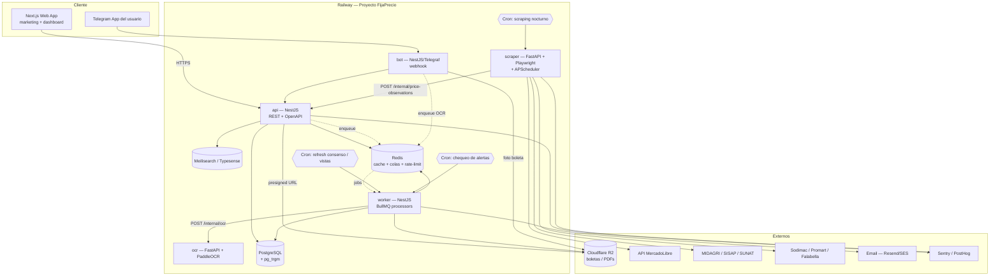

# FijaPrecio — Arquitectura de Software

> Documento de arquitectura (v1). Actúa como fuente de verdad para decisiones técnicas.
> Producto: asistente de **inteligencia de precios y costeo** para MYPES de LATAM (Perú primero).
> Despliegue objetivo: **Railway** (producción). Principio rector: **cero hardcodeo**.

---

## 1. Visión del producto (resumen para arquitectura)

FijaPrecio no es una calculadora de costos: es un sistema que **cruza el costo real validado** (bottom-up) **contra el precio de mercado en vivo** (top-down) y le dice al emprendedor **a cuánto vender y qué recortar para que le sea rentable**.

Cuatro capacidades nucleares que la arquitectura debe soportar de forma nativa:

| # | Capacidad | Naturaleza técnica |
|---|-----------|--------------------|
| 1 | **Costeo bottom-up** (BOM + mano de obra + gastos → precio sugerido) | Motor de cálculo determinista, config-driven |
| 2 | **Target Costing / ingeniería inversa** (precio de mercado → costo máximo permitido → análisis de sensibilidad) | Motor de optimización + ranking de insumos |
| 3 | **Base de precios colaborativa** (crowdsourcing + consenso estadístico + verificación por boleta/OCR) | Ingesta multi-fuente + estadística robusta + reputación |
| 4 | **Radar de competencia** (scraping/API de precios de producto final e insumos) | Microservicio de recolección + normalización + alertas |

Todo lo demás (bot de Telegram, autocompletado, planes premium, monetización de datos, lead-gen para proveedores) se construye **encima** de estas cuatro.

---

## 2. Principios de arquitectura

1. **Config-driven, no code-driven.** Ningún valor de negocio vive en el código: márgenes por defecto, IGV, umbrales de outliers, límites de plan, cadencia de scraping, fuentes habilitadas, selectores de scraping, textos, tasas de cambio → todo en **base de datos + variables de entorno + feature flags**. El código solo contiene *lógica*, nunca *parámetros*.
2. **12-Factor.** Configuración por entorno, procesos sin estado, backing services conectados por URL, logs a stdout. Encaja de forma natural con Railway.
3. **Fail-fast en el arranque.** Cada servicio valida su configuración contra un esquema (Zod / pydantic) al iniciar. Si falta una variable requerida, el servicio **no levanta** — nunca corre con un default silencioso.
4. **Un único dueño del esquema de datos.** El core (NestJS + Prisma) es el propietario de las migraciones. Los demás servicios consumen vía API interna o acceso de solo-lectura controlado.
5. **Multi-tenant desde el día 1.** Cada fila pertenece a una `organization`. El aislamiento se valida en la capa de aplicación y, opcionalmente, con Row-Level Security de Postgres.
6. **Fuentes oficiales antes que scraping.** Si existe API pública (MercadoLibre, MIDAGRI/SISAP, SUNAT tipo de cambio), se usa la API. El scraping es el último recurso y siempre con rate-limiting y respeto de ToS.
7. **Todo lo lento es asíncrono.** OCR, scraping bajo demanda, generación de PDF, recálculo de consenso, notificaciones → colas (BullMQ), nunca en el request HTTP.
8. **Preparado para portar.** Railway es el hosting inicial, no una dependencia dura. Nada de SDKs propietarios de Railway en el código; solo variables de entorno estándar. Migrar a Fly.io / Render / VPS debe ser cuestión de recrear variables.

---

## 3. Mapa: funcionalidades del negocio → módulos del sistema

| Funcionalidad (negocio.txt) | Módulo | Servicio |
|------------------------------|--------|----------|
| Calculadora "a cuánto vender" | `costing` | API core |
| Precio promedio por defecto, editable | `pricing-intelligence` + `catalog` | API core |
| Combobox: texto libre o selección de lista | `catalog` + búsqueda | API core + Search |
| Base colaborativa de precios (crowdsourcing) | `price-observations` | API core |
| Consenso estadístico / descarte de outliers | `consensus-engine` | Worker |
| Similitud de texto (Levenshtein / ILIKE / trigram) | `catalog-matching` | API core (Postgres `pg_trgm`) |
| Scraping de retailers (ML, Sodimac, Promart, Falabella) | `scraper` | Microservicio Python |
| Datos abiertos del Gobierno (MIDAGRI/SISAP) | `gov-data-connectors` | Microservicio Python |
| Catálogos B2B por CSV de proveedores | `supplier-catalogs` | API core |
| Carga de boletas por Telegram + OCR | `telegram-bot` + `ocr` | Bot + Microservicio OCR |
| "Precio Verificado" | `price-observations` (source=OCR) | API core |
| Target Costing / ingeniería inversa | `target-costing` | API core |
| Radar de competencia (min / promedio / premium) | `market-radar` | API core + Scraper |
| Análisis de sensibilidad / cuello de botella | `sensitivity-analysis` | API core |
| Simulador de escenarios bajo restricciones | `scenario-simulator` | API core |
| Alerta temprana de pérdida de rentabilidad | `alerts` | Worker + Cron |
| Planes Free / Premium y límites | `billing` + `entitlements` | API core |
| Exportar a catálogo PDF / mini e-commerce | `export` | Worker |
| Lead-gen para proveedores | `marketplace-ads` | API core |
| Monetización de datos (informes agregados) | `analytics` / `data-products` | Pipeline analítico |

---

## 4. Vista de arquitectura de alto nivel



---

## 5. Stack tecnológico (con justificación y alternativas)

### 5.1 Frontend

| Elemento | Elección | Por qué | Alternativa |
|----------|----------|---------|-------------|
| Framework | **Next.js 15 (App Router) + TypeScript** | Necesitas SEO fuerte para landing (el objetivo es que la gente *deje de googlear* → tu web debe posicionar), y una SPA rica para el dashboard. Next.js cubre ambos: SSG para marketing, RSC/CSR para la app. | Nuxt 4 (Vue) si el equipo domina Vue; Vite + React Router para SPA pura + Astro para marketing |
| Estilos | **Tailwind CSS + shadcn/ui (Radix)** | Velocidad, accesibilidad, componentes que son tuyos (no dependencia de librería) | Mantine, Chakra |
| Estado servidor | **TanStack Query** | Cache, revalidación, optimistic updates para el "ecualizador" de costos | SWR |
| Estado cliente | **Zustand** | Ligero, para el simulador de escenarios | Redux Toolkit si crece |
| Gráficas | **Recharts** (o **visx** para el radar) | El radar de competencia y las curvas de sensibilidad necesitan charts custom | Chart.js, ECharts |
| Formularios | **React Hook Form + Zod** | Validación compartida con el backend (mismos schemas Zod) | Formik |
| i18n | **next-intl** | Español primero, inglés/portugués después. Textos fuera del código. | react-i18next |
| Tablas/grids | **TanStack Table** | Fichas técnicas y BOM son tablas editables | AG Grid (si se necesita nivel Excel) |

**Implementado — `apps/web/` (fases 1–2)**: Next.js 15 App Router + React 19. Tailwind v4 (tokens en `src/styles/globals.css`, sin `tailwind.config`), primitivas propias en `src/components/ui/` (Button, Field/FieldMini, Select, Card, Callout, Badge, Spinner, Toggle, Stat, Tabs, Dialog) — sin shadcn CLI. **next-intl** con locale único `es` (todos los textos en `messages/es.json`, "cero hardcodeo"). **TanStack Query** (`Providers`, retry que respeta 4xx). **React Hook Form + Zod** (`src/lib/schemas.ts` replica los DTO del backend — no se importa `shared-types` en el cliente para no arrastrar Prisma; `src/lib/types.ts` tiene las formas de respuesta). Cliente HTTP: `src/lib/api.ts` (navegador, `credentials:'include'`, refresh single-flight en 401 + reintento) y `src/lib/api-server.ts` (RSC, reenvía cookies, sin refresh). `middleware.ts` = portón rápido por cookie `fp_at`.

- **Fase 1 (fundación + auth)**: `/login`, `/register`, shell autenticado (`(app)/layout.tsx` verifica `/auth/me` server-side → `AppShell` con sidebar + campana de notificaciones + menú de usuario), `/dashboard`, `/settings` (cuenta + entitlements del plan + config efectiva), `/notifications`. `error.tsx` / `global-error.tsx` / `not-found.tsx`.
- **Fase 2 (productos + costeo + radar + alertas)**: `/products` (lista → nuevo endpoint `GET /v1/products`), `/products/new` (form con `useFieldArray` para líneas de receta + componentes de costo, autocompletado de insumos vía `pg_trgm`, `datalist` de `units.allowed`), `/products/[id]` con tabs **Costeo** (ecualizador) · **Sensibilidad** · **Radar** (escala horizontal SVG min→premium con bandas + puntero de tu precio, sin dep de charts). `/alerts` CRUD (Dialog de alta/edición + toggle + borrar).
- **Fase 3 (simulador de escenarios + tests)**: cuarta pestaña **Escenarios** en `/products/[id]`. Gated por `config['scenario_simulator']` → upsell o `ScenarioBuilder` (estado local `DraftScenario[]`, no RHF): overrides tipados, **Comparar** → `POST .../scenarios/compare` → tabla base vs escenarios con deltas coloreados, **Guardar**/recalcular/eliminar. Payload puro y testeado en `lib/scenario-draft.ts`. `vitest` en `apps/web` (config propia, entorno node, sólo `src/**/*.test.ts`).
- **Fase 4 (editar producto/receta + historial del radar + migración de lint)**:
  - **Backend**: `PATCH /v1/products/:id` (campos del producto, `rubro`/targets `null` = limpiar, `status` → set/clear `archivedAt`) · `PUT /v1/products/:id/recipe` (crea receta v+1, desactiva la anterior en la misma tx; reusa el helper `writeRecipe` con `resolveCanonicals` + find-or-create de `OrgInput`) · `GET /v1/products/:id/market-radar/history?region=` → serie de `MarketPrice` acotada por `radar_history_days` (entitlement).
  - **Frontend**: `/products/[id]/edit` reusa `ProductForm` (ahora acepta `product?`; helpers puros en `lib/product-form.ts`: `productToFormValues`/`formToCreatePayload`/`formToRecipePayload`/`formToUpdatePayload`) → edit hace `PATCH` + `PUT recipe`. Botón "Editar" en el detalle. Gráfico de historial en la pestaña Radar: **Recharts** (`ComposedChart`: área mín–premium + línea de mediana + línea de promedio), lazy-loaded con `next/dynamic` (`ssr:false`) para no cargar ~100 kB en el resto del detalle. Helpers puros `lib/radar-chart.ts`.
  - **Lint**: `apps/web` migró de `next lint` (deprecado) a `eslint.config.mjs` flat (`FlatCompat` traduce `next/core-web-vitals`; reusa `@fijaprecio/eslint-config`). Ahora la regla "cero hardcodeo" (`no-restricted-syntax` sobre `process.env`) también cubre `web`.

Build/typecheck/lint/test verdes; el flujo real end-to-end no probado (Docker caído). **Pendiente**: `unitCostOverride` por línea no se edita desde el form (sólo `lastKnownPrice` del `OrgInput`) · tests de componentes (RTL + jsdom) · landing/SEO · el radar necesita `>= 2` snapshots para dibujar el gráfico.

### 5.2 Backend — API core

| Elemento | Elección | Por qué |
|----------|----------|---------|
| Framework | **NestJS 11 + TypeScript** | Ya lo dominas. Modular, DI, ideal para SaaS B2B con muchos dominios (costing, catalog, billing…). |
| ORM | **Prisma** | DX superior, migraciones declarativas, tipos generados. Único dueño del esquema. |
| Base de datos | **PostgreSQL 16** | Relacional (BOM, recetas, transacciones), + `pg_trgm` (similitud de texto), + `unaccent` (tildes), + `jsonb` (config flexible), + vistas materializadas (consenso/analytics). MySQL no da el mismo juego de extensiones. |
| Cache / colas / rate-limit | **Redis** + **BullMQ** | Colas para OCR, scraping on-demand, PDF, notificaciones, recálculo de consenso. Cache de sugerencias de precio. Rate-limiting por org/plan. |
| Auth | **Passport (JWT access + refresh rotativo)** + argon2 | Cookies httpOnly para web, tokens para bot/servicios. Multi-tenant: `organizationId` en el JWT. |
| Autorización | **CASL** (ability-based) | Roles (owner/admin/member) + entitlements por plan en la misma capa. |
| API contract | **REST + OpenAPI (Swagger)** | GraphQL es sobre-ingeniería aquí. OpenAPI genera cliente TS para el front. |
| Validación | **Zod** (compartido con front) o `class-validator` | Schemas de entrada; nada entra sin validar. |
| Realtime | **Socket.IO** (namespace por org) | Notificaciones de alerta, progreso de OCR, actualización del radar en vivo. |
| Jobs recurrentes | **BullMQ repeatable jobs** disparados por **Railway Cron** | El cron de Railway invoca un endpoint/worker; BullMQ orquesta. |

### 5.3 Microservicios Python

| Servicio | Stack | Notas |
|----------|-------|-------|
| **scraper** | **FastAPI** + **Playwright** (sitios con JS) + **httpx + selectolax** (sitios simples) + **APScheduler** | Async. Proxies rotativos vía proveedor externo (config). Normalización: dedupe → descarte de outliers (MAD/IQR) → mediana. |
| **gov-data-connectors** | FastAPI + **pandas** | Descarga SISAP/MIDAGRI, tipo de cambio SUNAT/SBS, normaliza a `price_observations` con `source=OFFICIAL`. |
| **ocr** | FastAPI + **PaddleOCR** (primario) + **Tesseract** (fallback) + parser de boletas propio | Interfaz `OcrProvider` intercambiable: si mañana quieres AWS Textract / Google Vision / Gemini, es un adaptador + una variable, sin tocar el flujo. |

**Config Python:** `pydantic-settings` (`BaseSettings`) — mismo principio fail-fast que NestJS.

**¿Por qué Python separado y no todo en Node?** El scraping serio y el OCR viven mejor en el ecosistema Python (Playwright-Python, Scrapy, PaddleOCR, pandas). Además aísla el riesgo: si un scraper se cuelga o consume RAM, no tumba la API.

### 5.4 Búsqueda / autocompletado

| Elemento | Elección | Por qué |
|----------|----------|---------|
| Motor | **Typesense** (o Meilisearch) | Autocompletado tolerante a typos e instantáneo para el combobox de insumos ("algodon pima" ≈ "algodón pima 20/1"). Fácil de correr en Railway con un volumen. |
| Matching canónico | **Postgres `pg_trgm` + `similarity()`** en el backend | Al ingresar un insumo nuevo: normalizar (lowercase, `unaccent`, quitar unidades) → buscar `canonical_input` por trigram → asignar o crear uno "pendiente de revisión". |
| Fallback | `ILIKE` con índice GIN | Si no se despliega Typesense en el MVP. |

> **Levenshtein** puro se usa solo para desempates finos (distancia ≤ 2) porque es O(n·m); el trabajo grueso lo hace trigram (indexable).

**Implementado** (`apps/api/src/catalog/`, `normalize.ts` puro + 6 tests): `normalizeInputName(text, units)` (minúsculas → sin tildes → sin unidades [de `units.allowed`] / códigos numéricos / conectores). `CatalogService.search()` usa `pg_trgm` con el índice GIN (`SET LOCAL pg_trgm.similarity_threshold` + operador `%`, ranking por `similarity()`, busca en `normalizedName` y en `normalizedAlias`). `resolveOrCreateCanonical(name, unit)`: match ≥ `catalog.match_auto_assign_similarity` (0.62) → asigna + guarda el texto original como alias; si no → crea `CanonicalInput` con `catalog.autocreate_canonical_status` (PENDING_REVIEW). `POST /v1/products` ahora auto-resuelve el `canonicalInputId` de cada `OrgInput` → los precios de consenso fluyen sin intervención. Endpoints: `GET /v1/catalog/inputs?q=` (autocompletado), `GET /v1/catalog/inputs/:id`, `POST /v1/catalog/inputs`, `GET /v1/catalog/categories`. **Pendiente**: merge/dedup de canónicos (status MERGED + cola de revisión), desempate Levenshtein, Typesense (ADR-04: `pg_trgm` hasta ~10k insumos).

### 5.5 Infraestructura de apoyo

| Necesidad | Elección | Por qué |
|-----------|----------|---------|
| Object storage (boletas, PDFs, catálogos) | **Cloudflare R2** (S3-compatible) | Sin cargo por egress. Presigned URLs. **No** usar volúmenes de Railway para esto. |
| Email transaccional | **Resend** (o AWS SES) | Alertas de rentabilidad, magic links, reportes. |
| Feature flags | **Unleash** (self-host en Railway) o tabla `feature_flags` + panel admin | Activar/desactivar fuentes de scraping, proveedores OCR, límites de plan **sin redeploy**. |
| Secret management | Railway env vars + (opcional) **Infisical** self-host | Rotación, auditoría, entornos. |
| Error tracking | **Sentry** | API, worker, scraper, front. |
| Product analytics | **PostHog** (self-host o cloud) | Embudo de activación, qué features retienen. |
| Uptime | **BetterStack** / UptimeRobot | Healthchecks externos. |
| Logs | **pino** (Node) / **structlog** (Python) → stdout | Railway los captura; exportables a un drain. |

### 5.6 Tooling / repo

| Elemento | Elección |
|----------|----------|
| Monorepo | **pnpm workspaces + Turborepo** para JS/TS; paquetes Python independientes (`uv` o Poetry) |
| Estructura | `apps/{web,api,worker,bot}`, `services/{scraper,ocr}`, `packages/{db,config-schema,shared-types,tsconfig,eslint-config}` |
| Lint/format | ESLint + Prettier + Ruff (Python) |
| Tests | Vitest/Jest (unit), Supertest (API), pytest (Python), Playwright (E2E) |
| Contratos | OpenAPI generado → cliente TS en `packages/api-client` |
| CI | GitHub Actions: lint + test + build; Railway hace el deploy por watch-paths |
| Pre-commit | Husky + lint-staged / pre-commit (Python) |

---

## 6. Topología de despliegue en Railway

### 6.1 Servicios del proyecto

Un solo **proyecto Railway** con **dos entornos**: `staging` y `production` (+ PR environments efímeros).

| Servicio | Origen (monorepo) | Builder | Comando | Escala inicial |
|----------|-------------------|---------|---------|----------------|
| `web` | `apps/web` | Nixpacks/Railpack | `next start` | 1 |
| `api` | `apps/api` | Nixpacks | `node dist/main.js` | 1 (healthcheck `/health`) |
| `worker` | `apps/worker` | Nixpacks | `node dist/worker.js` | 1 |
| `bot` | `apps/bot` | Nixpacks | `node dist/bot.js` (webhook) | 1 |
| `scraper` | `services/scraper` | Dockerfile (Playwright necesita browsers) | `uvicorn app.main:app` | 1 |
| `ocr` | `services/ocr` | Dockerfile (PaddleOCR) | `uvicorn app.main:app` | 1 |
| `search` | template Typesense | — | — | 1 + **volumen** |
| `Postgres` | plugin nativo Railway | — | — | — |
| `Redis` | plugin nativo Railway | — | — | — |

**Cron services** (servicios que arrancan, ejecutan y terminan; Railway los relanza según schedule):

| Cron | Schedule (ejemplo, configurable) | Acción |
|------|----------------------------------|--------|
| `cron-scrape-nightly` | `0 5 * * *` (medianoche Perú) | Refresca precios de los N insumos/productos más consultados. |
| `cron-gov-sync` | `0 6 * * *` | Descarga SISAP/MIDAGRI + tipo de cambio. |
| `cron-consensus-refresh` | `*/30 * * * *` | Recalcula `price_consensus` + vistas materializadas. |
| `cron-alerts-check` | `0 * * * *` | Detecta caídas de margen y encola notificaciones. |
| `cron-cleanup` | `0 3 * * *` | Retención de boletas, purga de jobs viejos, anonimización para data-products. |

> Los schedules **no se hardcodean**: viven como variables (`CRON_SCRAPE_SCHEDULE`) o en tabla `scheduled_tasks`. El cron de Railway solo dispara; la lógica de *qué* correr la decide el servicio leyendo config.

### 6.2 Networking

- Comunicación interna vía **private networking** de Railway: `api.railway.internal`, `scraper.railway.internal`, etc. (IPv6, sin salir a internet, sin costo de egress).
- Solo `web`, `api` y `bot` exponen dominio público.
- `scraper` y `ocr` **no** tienen dominio público: solo se alcanzan desde `api`/`worker` por red privada + token interno (`INTERNAL_API_TOKEN`).

### 6.3 Config-as-code

Cada app lleva su `railway.json` (o `railway.toml`):

```json
{
  "$schema": "https://railway.com/railway.schema.json",
  "build": { "builder": "NIXPACKS", "watchPatterns": ["apps/api/**", "packages/**"] },
  "deploy": {
    "startCommand": "node dist/main.js",
    "healthcheckPath": "/health",
    "healthcheckTimeout": 30,
    "restartPolicyType": "ON_FAILURE",
    "restartPolicyMaxRetries": 3
  }
}
```

### 6.4 Estrategia de entornos

| Entorno | Uso | Datos |
|---------|-----|-------|
| **local** | desarrollo | `docker-compose` (Postgres, Redis, Typesense, MinIO como R2) |
| **staging** (Railway) | QA, demos, pruebas de scraping | DB propia, R2 bucket propio, bot de Telegram de prueba |
| **production** (Railway) | usuarios reales | DB propia, backups, alertas |
| **PR envs** (Railway) | revisión de cada PR | DB efímera sembrada con seeds |

Nunca se comparten credenciales entre entornos. Las variables se resuelven con **reference variables** de Railway: `DATABASE_URL=${{Postgres.DATABASE_URL}}`, `REDIS_URL=${{Redis.REDIS_URL}}`, `SCRAPER_URL=http://${{scraper.RAILWAY_PRIVATE_DOMAIN}}`.

---

## 7. Gestión de configuración — el "cero hardcodeo" en detalle

Tres niveles de configuración, cada uno con su lugar:

### Nivel 1 — Infra / secretos → **variables de entorno** (Railway)

Conexiones, llaves, URLs, toggles de despliegue. Validadas al arranque.

```ts
// packages/config-schema/src/api.ts
import { z } from 'zod';

export const apiEnvSchema = z.object({
  NODE_ENV: z.enum(['development', 'staging', 'production']),
  PORT: z.coerce.number().default(3000),
  DATABASE_URL: z.string().url(),
  REDIS_URL: z.string().url(),
  JWT_SECRET: z.string().min(32),
  JWT_ACCESS_TTL: z.string().default('15m'),
  JWT_REFRESH_TTL: z.string().default('30d'),
  R2_ENDPOINT: z.string().url(),
  R2_ACCESS_KEY_ID: z.string(),
  R2_SECRET_ACCESS_KEY: z.string(),
  R2_BUCKET: z.string(),
  SCRAPER_URL: z.string().url(),
  OCR_URL: z.string().url(),
  INTERNAL_API_TOKEN: z.string().min(32),
  TYPESENSE_URL: z.string().url().optional(),
  TYPESENSE_API_KEY: z.string().optional(),
  RESEND_API_KEY: z.string().optional(),
  SENTRY_DSN: z.string().url().optional(),
  TELEGRAM_BOT_TOKEN: z.string(),
  TELEGRAM_WEBHOOK_SECRET: z.string(),
  DEFAULT_CURRENCY: z.string().length(3).default('PEN'),
  DEFAULT_LOCALE: z.string().default('es-PE'),
});

// main.ts — antes de crear la app
const env = apiEnvSchema.parse(process.env); // lanza y aborta si falta algo
```

> Regla: si aparece un `process.env.X` fuera de `config-schema`, es un bug.

### Nivel 2 — Parámetros de negocio → **tablas de configuración en Postgres** + panel admin

Cambian sin redeploy. Ejemplos:

| Tabla | Contenido | Ejemplos de fila |
|-------|-----------|------------------|
| `app_settings` | clave/valor tipado (jsonb), scope global u org | `tax.igv_rate = 0.18`, `consensus.min_sample_size = 5`, `consensus.outlier_method = "MAD"`, `consensus.mad_threshold = 3.5` |
| `plans` | definición de planes | Free, Premium, Business |
| `plan_entitlements` | límites por plan | `ocr_receipts_per_month`, `scraper_refresh_cadence`, `scenario_simulator = true` |
| `costing_defaults` | defaults del motor de costeo por org | `default_margin_pct`, `overhead_allocation_method`, `labor_rate_per_hour` |
| `scraping_sources` | fuentes y su config | `{ name: "Promart", type: "playwright", base_url, search_path, selectors: {...}, enabled: true, rate_limit_rpm: 10 }` |
| `gov_data_sources` | endpoints de datos abiertos | SISAP, MIDAGRI, SBS TC |
| `notification_templates` | plantillas de alerta/email | por idioma |
| `feature_flags` | flags de rollout | `radar_v2`, `marketplace_ads` |

Los **selectores de scraping viven en la DB**, no en el código Python. Si Promart cambia su HTML, editas una fila (o un JSON en el panel), no haces deploy.

### Nivel 3 — Datos por usuario → tablas de dominio normales

Márgenes que el usuario define, sus recetas, sus proveedores, etc.

### Resolución de configuración (precedencia)

```
valor efectivo = override de organización
              ?? valor por plan
              ?? default global (app_settings)
              ?? default del código (solo como última red de seguridad, y logueado como warning)
```

Un servicio `ConfigService` centraliza esto con cache en Redis (TTL corto + invalidación por evento al guardar en el panel).

---

## 8. Modelo de datos (dominio principal)

Esquema lógico resumido (Prisma-style, PostgreSQL).

### 8.1 Tenancy e identidad

```
organizations         (id, name, country, region, currency, locale, created_at)
users                 (id, email, password_hash, name, locale, created_at)
memberships           (id, user_id, organization_id, role[owner|admin|member])
subscriptions         (id, organization_id, plan_id, status, current_period_end, provider_ref)
plans                 (id, code, name, price_month, active)
plan_entitlements     (id, plan_id, key, value_json)
```

### 8.2 Catálogo e insumos

```
canonical_inputs      (id, name, normalized_name, category_id, base_unit, status[active|pending|merged], merged_into_id)
canonical_input_aliases (id, canonical_input_id, alias, normalized_alias, weight)
input_categories      (id, name, parent_id, rubro)   -- confección, gastronomía, muebles...
org_inputs            (id, organization_id, canonical_input_id?, display_name, unit, last_known_price, currency)
suppliers             (id, organization_id?, name, is_public, contact, verified)
supplier_catalog_items(id, supplier_id, canonical_input_id, price, currency, unit, valid_from, source[csv|manual|api])
```

### 8.3 Productos y costeo

```
products              (id, organization_id, name, rubro, target_margin_pct?, target_price?, status)
product_recipes       (id, product_id, version, is_active, notes)          -- ficha técnica versionada
recipe_lines          (id, recipe_id, org_input_id, quantity, unit, waste_pct)
cost_components       (id, recipe_id, type[labor|overhead|packaging|shipping|platform_fee|other],
                       calc[fixed|per_unit|pct_of_cost|per_hour], value, meta_json)
costing_snapshots     (id, product_id, recipe_id, computed_at, total_cost, unit_cost breakdown_json,
                       suggested_price, margin_pct, inputs_hash)            -- resultado auditable
```

### 8.4 Inteligencia de precios

```
price_observations    (id, canonical_input_id?, product_ref?, scope[input|final_product],
                       price, currency, unit, region, source[manual|ocr|scrape|official|supplier],
                       source_ref, reporter_user_id?, reporter_reputation, observed_at, created_at,
                       status[active|rejected|pending_review], rejection_reason)
price_consensus       (canonical_input_id, region, scope, currency,
                       median, p25, p75, mean, mad, sample_size, confidence, updated_at)  -- materializado
market_prices         (id, product_query, region, min_price, avg_price, premium_price,
                       sample_size, source_breakdown_json, captured_at)
reputation_events     (id, user_id, delta, reason, created_at)
```

### 8.5 Boletas / OCR

```
receipts              (id, organization_id, uploaded_by, storage_key, channel[telegram|web],
                       status[received|processing|parsed|confirmed|failed], ocr_provider, raw_text,
                       created_at, processed_at)
receipt_line_items    (id, receipt_id, raw_description, matched_canonical_input_id?, quantity, unit,
                       unit_price, total, confidence, confirmed)
```

### 8.6 Scraping y datos externos

```
scraping_sources      (id, name, type[playwright|http|api], base_url, config_json, enabled,
                       rate_limit_rpm, last_run_at)
scraping_jobs         (id, source_id, query, status, requested_by[cron|user], started_at,
                       finished_at, result_count, error)
gov_data_sources      (id, name, kind[sisap|midagri|tc], endpoint, config_json, enabled)
exchange_rates        (id, base, quote, rate, source, valid_on)
```

### 8.7 Alertas, notificaciones, auditoría

```
alerts                (id, organization_id, product_id?, canonical_input_id?, type, threshold_json,
                       enabled, last_triggered_at)
notifications         (id, organization_id, user_id?, channel[inapp|email|telegram], template_code,
                       payload_json, status, sent_at)
audit_log             (id, organization_id?, actor_id?, action, entity, entity_id, diff_json, created_at)
app_settings          (id, scope[global|org], organization_id?, key, value_json, updated_by, updated_at)
feature_flags         (id, key, description, strategy_json, enabled)
```

### 8.8 Índices clave

- `canonical_inputs.normalized_name` → **GIN `gin_trgm_ops`**
- `canonical_input_aliases.normalized_alias` → GIN trgm
- `price_observations (canonical_input_id, region, observed_at)` → recálculo de consenso
- `price_observations` partición por mes (`observed_at`) cuando el volumen crezca
- RLS opcional: `USING (organization_id = current_setting('app.current_org')::uuid)`

---

## 9. Motores de negocio

### 9.1 Motor de costeo (bottom-up)

Función pura, determinista, testeable. Toma una `recipe` + `config efectiva` → `costing_snapshot`.

```
costo_insumos   = Σ (recipe_line.quantity × (1 + waste_pct) × precio_unitario_efectivo)
costo_mano_obra = Σ cost_components(type=labor)      // per_hour × horas, o fixed
overhead        = f(overhead_allocation_method, costo_directo)   // % o prorrateo
costo_total     = costo_insumos + costo_mano_obra + overhead + packaging + shipping
precio_sin_impuesto = costo_total / (1 - margin_pct)              // markup sobre precio, no sobre costo
precio_final    = precio_sin_impuesto × (1 + igv_rate)           // si aplica
```

- `precio_unitario_efectivo` se resuelve: precio que el usuario fijó → si no, `price_consensus.median` de su región → si no, promedio nacional → si no, catálogo de proveedor.
- `margin_pct`, `igv_rate`, `overhead_allocation_method` → **config nivel 2**, nunca constantes.
- Cada snapshot guarda el `breakdown_json` y un `inputs_hash` para saber si está desactualizado.

**Implementado** (`apps/api/src/costing/engine.ts`, función pura + 14 tests): orden fixed/per-unit/per-hour → `PCT_OF_DIRECT_COST` → `PCT_OF_TOTAL_COST` (base fija = subtotal, evita recursión). `precio = markupOnPrice ? unit/(1-m) : unit×(1+m)` según `costing.price_from_markup_on_price`. Org sin IGV ⇒ override `tax.igv_rate = 0`. `ProductRecipe.outputQuantity` (nuevo, migración `20260908004818`) da el `unitCost`. Resolución de precio: `unitCostOverride` → `orgInput.lastKnownPrice` → **`PriceConsensus.median`** del insumo canónico (región de la org, si `confidence ≥ consensus.confidence_min_to_show`) → marcado `missing` con warning (proveedor llega con su fase). Endpoints: `GET /v1/products` (lista, sólo metadatos), `POST /v1/products`, `GET /v1/products/:id` (detalle serializado: producto + receta activa con líneas/componentes), `PATCH /v1/products/:id` (campos del producto), `PUT /v1/products/:id/recipe` (nueva versión de receta, desactiva la anterior), `GET /v1/products/:id/costing`, `POST /v1/products/:id/costing/snapshots`. Target costing calcula `targetCost`/`costGap`; el ranking de sensibilidad (§9.3) es fase aparte.

### 9.2 Target Costing (top-down / ingeniería inversa)

```
Entrada: target_price (del mercado o fijado por el usuario), margin_pct objetivo
costo_maximo_permitido = target_price / (1 + igv_rate) × (1 - margin_pct)
gap = costo_total_actual - costo_maximo_permitido
```

Si `gap > 0`: el motor de **sensibilidad** entra en acción.

### 9.3 Análisis de sensibilidad / cuello de botella

Para cada `recipe_line` y `cost_component`:

```
contribucion_pct = costo_de_esta_linea / costo_total
elasticidad      = Δprecio_final / Δcosto_de_esta_linea   (≈ 1/(1-margin) normalizado)
reduccion_necesaria_en_esta_linea = gap / costo_de_esta_linea   // si todo el ajuste saliera de aquí
```

Salida ordenada por `contribucion_pct` desc → "La tela es el 65% de tu costo. Bajándola de S/15 a S/12 (−20%) cierras el gap de S/3.20."

También cruza con `price_consensus`: "hay proveedores reportando esta tela a S/12.50 en Lima" → convierte el análisis en una acción concreta.

**Implementado** (`apps/api/src/costing/sensitivity.ts`, puro + 9 tests): `analyzeSensitivity(input, config)` reusa `CostingService.prepare()`. Como `unitCost` es lineal en el precio de cada insumo y en el `value` de cada componente (incluso a través de los % ), el "precio que cierra la brecha" se resuelve exacto con 2 evaluaciones del motor (baseline + knob en 0 → pendiente), lo que respeta la cascada de los componentes `PCT_*`. Por driver: `contributionPct`, `gapCloseUnitPrice`/`gapCloseReductionPct`, `feasibleAlone` (recorte ≤ 100%), `marketMedianPrice` (mediana del consenso del insumo). Si el usuario paga por encima del mercado, el `headline` lo dice: _"…El mercado reporta ese insumo cerca de 4.2."_ Endpoint `GET /v1/products/:id/costing/sensitivity`.

### 9.4 Simulador de escenarios

Un escenario = `recipe base` + lista de `overrides` (cambiar cantidad, cambiar insumo, cambiar proveedor, cambiar margen). El motor recalcula N escenarios en paralelo y devuelve una tabla comparativa. Premium: clonar línea de producción completa, comparar 5+ escenarios, guardar y versionar.

**Implementado** (`apps/api/src/scenarios/` + `costing/scenario-engine.ts`, puro + 9 tests): `applyScenarioOverrides(base, overrides)` transforma el `EngineInput` (tipos `RECIPE_LINE`/`INPUT_PRICE`/`SUPPLIER_SWAP`/`COST_COMPONENT`/`MARGIN`) y se corre el **mismo** `computeCosting`. `POST /v1/products/:id/scenarios/compare` devuelve base + cada escenario + `delta` (no persiste). CRUD persistido: `POST/GET /v1/products/:id/scenarios`, `GET/POST(:recompute)/DELETE /v1/scenarios/:id` (guarda `Scenario` + `ScenarioOverride[]` + `ScenarioResult[]`). Gated con `@RequireEntitlement('scenario_simulator')` (FREE → 403) y `scenario_max_overrides` por escenario. "Clonar línea de producción" y swap con catálogo real de proveedor: pendientes.

### 9.5 Motor de consenso estadístico

Corre en el **worker**, disparado por (a) nueva `price_observation`, (b) cron cada 30 min.

```
1. Filtrar observaciones activas del (canonical_input, region, scope) en ventana temporal
   (ej. últimos 90 días, configurable) con decaimiento por recencia.
2. Ponderar por source y reputación:
      w = source_weight[source] × recency_decay(observed_at) × reporter_weight
      source_weight por defecto: official 1.0, ocr 0.9, supplier 0.8, scrape 0.7, manual 0.5
3. Detección de outliers — MAD (Median Absolute Deviation), más robusto que desviación estándar
   en distribuciones de precio sesgadas:
      mad = median(|x_i - median(x)|)
      z_i = 0.6745 × (x_i - median(x)) / mad
      descarta si |z_i| > mad_threshold (default 3.5, configurable)
   Fallback a IQR si sample pequeño.
4. Marcar descartados como status=rejected (auditable, reversible), NO borrar.
5. Calcular median, p25, p75, weighted mean, sample_size.
6. confidence = f(sample_size, dispersión, diversidad de fuentes, antigüedad).
7. Upsert en price_consensus. Emitir evento → invalida cache → notifica si cambió >X%.
```

> Los parámetros (`ventana`, `mad_threshold`, `source_weight`, `min_sample_size`, umbral de confianza para mostrar sugerencia) son filas de `app_settings`.

**Implementado** (`apps/worker/src/consensus/`, engine puro + 10 tests): `computeConsensus(observations, config, now)`. MAD si `n ≥ 2×min_sample_size`, si no IQR; si el recorte deja `< min_sample_size` revierte y acepta todo. Media ponderada = `source_weight × recency_decay(half-life) × reputation_weight` (1×→`max_weight_multiplier` interpolando hasta `consensus.reputation_full_weight_at`). `confidence` = mezcla ponderada (`consensus.confidence_weights`) de tamaño / dispersión relativa (MAD/median) / diversidad de fuentes. Outliers → `status=REJECTED, rejectionReason='consensus:outlier'` (reversible: si vuelve a caer dentro, se re-activa). Config global vía `loadConsensusConfig` (fail-loud si falta un AppSetting). Disparo: cola BullMQ `consensus.recalc` (encolada por `api` al ingerir) + job repetible `consensus.sweep` cada `CONSENSUS_SWEEP_INTERVAL_MINUTES`. Ingesta: `POST /v1/price-observations` (manual, autenticado) y `POST /v1/internal/price-observations` (batch, `X-Internal-Token`). Lectura: `GET /v1/inputs/:id/consensus`. El costeo y la sensibilidad ya lo consumen (`CostingService.prepare()` hace una query de `PriceConsensus` por receta y devuelve `marketMedians` por línea). **Pendiente**: eventos de reputación por transición (idempotencia), conversión de unidades en la ingesta, notificación si el consenso se mueve > `consensus.notify_change_pct`.

### Radar de competencia (producto final)

**Implementado**: el scraper también raspa `scope=FINAL_PRODUCT`: `GET {api}/v1/internal/radar-targets` (productos ACTIVE, snapshot más viejo primero) → colecta el nombre del producto de todas las fuentes → `aggregate_market_price` (min / p25 / avg / median / p75 / p90 tras recortar extremos, `sourceBreakdown` por retailer) → `POST {api}/v1/internal/market-prices` → fila `MarketPrice`. Lectura: `GET /v1/products/:id/market-radar` → `{ market, yourPrice: {suggested, target}, position: { vsMedianPct, headroomToMedian, verdict } }` con `verdict` ∈ below_market / value / competitive / premium / above_market (`computeRadarPosition`, puro, 7 tests). `GET /v1/products/:id/market-radar/history?region=` → serie temporal de `MarketPrice` (ventana = entitlement `radar_history_days`) para el gráfico. El barrido periódico del scraper corre insumos **y** radar.

### 9.6 Reputación del aportante

`reputation_events` acumulan/restan puntos:
- +N por observación que sobrevive al consenso
- +2N por dato verificado con boleta/OCR
- −N por observación marcada outlier repetidamente
- El peso del usuario en el consenso escala con su reputación (con techo).

---

## 10. Servicio de scraping (Python)

### 10.1 Fuentes y método

| Fuente | Método | Notas |
|--------|--------|-------|
| **MercadoLibre Perú** | **API oficial** (`sites/MLP/search`) | Tiene API pública. Se registra app, OAuth. Evita scraping y baneos. |
| Sodimac / Promart / Falabella / Platanitos | **Playwright** (render JS) | Config de selectores en `scraping_sources.config_json`. Rate-limit por dominio. |
| Tiendas mayoristas / marketplaces menores | httpx + selectolax | Cuando el HTML es estático. |
| **MIDAGRI / SISAP** (precios mayoristas: papa, limón, pollo…) | Servicio web / descarga de datasets | `gov-data-connectors`. Datos oficiales → `source=official`, peso 1.0. |
| Tipo de cambio | API SBS / SUNAT | Para multi-moneda y normalización. |

### 10.2 Pipeline de normalización

```
raw_results
  → parse (precio, título, unidad, vendedor, url)
  → filtrar no relevantes (match de categoría/keywords)
  → convertir unidades a base_unit del canonical_input
  → convertir moneda a la de la org (exchange_rates)
  → descarte de outliers (MAD/IQR) — quita el más caro y el más barato extremos
  → mediana + min + p25 + p75 + premium (p90)
  → POST /internal/price-observations  (batch, idempotente por source_ref)
```

### 10.3 Anti-baneo y ética

- **Proxies rotativos** vía proveedor externo (ScraperAPI / Zyte / Bright Data) — endpoint y key en **variables de entorno**, activable/desactivable por fuente.
- Rate-limit configurable por dominio (`rate_limit_rpm` en la fila de la fuente).
- User-agents rotativos, backoff exponencial, respeto de `robots.txt` donde sea razonable.
- Cache: no re-scrapear lo consultado hace < `scrape_ttl` (config).
- **Preferir siempre la API oficial** cuando existe.
- Nota legal: revisar ToS de cada retailer; el scraping de precios públicos para agregación estadística es defendible, pero el radar debe mostrar *rangos y medianas*, no clonar catálogos ajenos.

### 10.4 Scraping bajo demanda vs. programado

- **Programado (cron nocturno):** top-N insumos/productos más consultados → respuesta instantánea al usuario (lee de `price_consensus` / `market_prices`).
- **Bajo demanda (Premium):** el usuario pide "refrescar ahora" → job en cola → resultado en 10-60s vía WebSocket. Free: solo datos del último batch programado.

**Implementado** (`services/scraper/`, FastAPI + `uv`, 20 tests de pipeline puro): APScheduler cada `SCRAPER_SWEEP_INTERVAL_MINUTES` → `GET {api}/v1/internal/scrape-targets` (insumos con `OrgInput` vivo, consenso más viejo primero) → por target, por cada `ScrapingSource` enabled: collector (`MercadoLibreCollector` API oficial / `HtmlCollector` httpx+selectolax / `PlaywrightCollector` lazy-import) → `pipeline` puro (`parse_price` multi-formato → `derive_unit_price` con `UnitConversion` → `trim_bounds` con `scraper.outlier_trim_pct`) → `POST {api}/v1/internal/price-observations` batch, idempotente por `sourceRef = {slug}:{YYYY-MM-DD}:{hash(url)}`. Config de scraping (selectores, search-path, field names) en `ScrapingSource.config`; cero parámetros en el código Python. `POST /internal/scrape` para on-demand. **Pendiente**: radar `FINAL_PRODUCT` → `MarketPrice`, conversión de moneda (USD se descarta), `gov-data-connectors`, registro de `ScrapingJob`.

---

## 11. OCR + Bot de Telegram

### 11.1 Flujo

```
Usuario → foto de boleta al bot de Telegram
  → bot (webhook) valida usuario/org, sube imagen a R2 (presigned), crea receipt(status=received)
  → encola job ocr:parse
  → worker llama POST /internal/ocr (servicio Python)
       → PaddleOCR extrae texto + layout
       → parser de boletas: detecta RUC, fecha, correlativo, tabla de ítems (desc, cant, PU, total), IGV
       → devuelve line items + confianza
  → worker hace matching de cada ítem contra canonical_inputs (trigram)
  → bot responde con resumen: "Detecté: Algodón 30/1 — S/18.00 x 5m. ¿Confirmas? [Sí] [Editar] [No]"
  → al confirmar: receipt_line_items.confirmed=true
       → crea price_observations(source=ocr) → "Precio Verificado"
       → actualiza org_inputs.last_known_price
       → recalcula costing_snapshots afectados → notifica si cambió el margen
```

### 11.2 OCR sin depender de IA de terceros

- **Primario:** PaddleOCR (open source, self-host en Railway vía Dockerfile). Buen rendimiento en documentos estructurados.
- **Fallback:** Tesseract + `unpaper`/OpenCV para preprocesado (deskew, threshold).
- **Parser de boletas propio:** las boletas peruanas tienen estructura semi-estándar (encabezado con RUC, cuerpo tabular, IGV 18%, total). Se construyen *templates* por retailer frecuente + heurística genérica (regex de montos `S/\s?\d+[.,]\d{2}`, alineación de columnas por coordenadas del OCR).
- **Interfaz `OcrProvider`** (adaptador): `PaddleProvider`, `TesseractProvider`, y espacio para `TextractProvider` / `VisionProvider` / `GeminiProvider` si algún día quieres pagar por precisión. Se elige por `app_settings.ocr.provider` **por plan** (Free → Paddle, Business → provider premium), sin tocar código.

**Implementado** (`services/ocr/`, FastAPI + `uv`, 12 tests de preprocesado): `POST /internal/ocr` → `preprocess` (OpenCV: grises → downscale → deskew → adaptiveThreshold) → `provider.recognize(image)` → `{rawText, lines:[{text,confidence,bbox}]}`. `TesseractProvider` funciona hoy; `PaddleProvider` bajo el extra `paddle` (imagen pesada, no default). El parseo (`@fijaprecio/receipt-parser`, TS puro, 22 tests) extrae RUC / nº doc / fecha / moneda / total / IGV / líneas (desc, cant, unidad, PU, total) con `confidence` por línea (heurística: región de tabla + tokens numéricos finales + valida `cant·PU≈total`).

### 11.3 Bot

- **nestjs-telegraf**, modo **webhook** (no polling) — Railway da URL pública, se registra con `setWebhook` + `secret_token`.
- Puede ser un servicio aparte (`bot`) o un módulo del `api`. Recomendación: servicio aparte para aislar y escalar el webhook.
- Vinculación de cuenta: el usuario genera un código en la web → lo envía al bot → se asocia `telegram_user_id ↔ user`.

**Implementado** (flujo completo cableado, falta smoke test integral): `POST /v1/telegram/link-code` (api) → `/link CODE` en el bot verifica el `TelegramLink`. Foto → bot sube a R2 (`@fijaprecio/storage`, MinIO local) → `Receipt(TELEGRAM)` → cola `ocr.parse`. Worker `OcrProcessor`: `storage.get` → `POST {OCR_URL}/internal/ocr` → `parseReceipt` → match por línea (`GET {API_URL}/v1/internal/catalog/match`) → persiste `ReceiptLineItem[]` → `POST {BOT_URL}/internal/notify`. Bot manda el resumen con botones ✅/❌ → confirmar llama `POST /v1/internal/receipts/:id/confirm` → `PriceObservation(source=OCR)` + `OrgInput.lastKnownPrice` + recálculo de consenso.

---

## 12. Notificaciones y alertas

- **Alertas configurables** (`alerts`): "avísame si el margen de PRODUCTO baja de X%", "si INSUMO sube más de Y%".
- `cron-alerts-check` (cada hora): recorre alertas activas, recalcula snapshots contra el consenso actual, dispara `notifications`.
- Canales: in-app (Socket.IO + centro de notificaciones), email (Resend), Telegram (reusa el bot).
- Plantillas en `notification_templates` por idioma — **texto fuera del código**.
- Anti-spam: agrupación (digest diario para Free, tiempo real para Premium), deduplicación por `alert_id + ventana`.

**Implementado** (`apps/api/src/{alerts,notifications}/`, reglas puras + 9 tests):
- CRUD `POST/GET/PATCH/DELETE /v1/alerts`, gated por `alerts_max`. Tipos: `MARGIN_DROP` (producto + `marginFloorPct` → recomputa costeo), `INPUT_PRICE_RISE` (insumo + `risePct` → `PriceConsensus.median` vs `OrgInput.lastKnownPrice`), `COMPETITOR_PRICE_DROP` (producto + `dropPct` → dos últimos `MarketPrice`). `CONSENSUS_SHIFT` pendiente (necesita histórico).
- El **worker** dispara `alerts.check` según `alerts.check_cron` (BullMQ repeatable pattern) → `POST /v1/internal/alerts/run` → `AlertsEvaluatorService.runAll()` (dedup por `Alert.lastTriggeredAt` + `notify.dedup_hours`; FREE → `Notification.scheduledFor` = próximo `alerts.digest_cron_free`, Premium → inmediato).
- `NotificationsProcessor` (worker, cada `NOTIFICATIONS_POLL_MINUTES`) procesa PENDING: renderiza `NotificationTemplate` (`renderTemplate` puro, `{{clave}}`), envía por canal — IN_APP (no-op, lo lee el front), EMAIL (Resend), TELEGRAM (`POST {bot}/internal/send-notification`).
- Centro de notificaciones: `GET /v1/notifications`, `/unread-count`, `POST /:id/read`, `/read-all`.

---

## 13. Multi-tenancy, auth y planes

### 13.1 Aislamiento

- `organizationId` obligatorio en toda entidad de negocio.
- `JwtAuthGuard` extrae `organizationId` del JWT → `AsyncLocalStorage` (`orgContextStorage.enterWith`) → los servicios lo inyectan en el `where`. **Implementado.**
- Refuerzo: **Postgres RLS**. Políticas en `20260907235300_manual_*` (21 tablas de tenant). El rol `fijaprecio_app` NOBYPASSRLS lo crea la migración `20260908113000_rls_app_role` (+ grants + ALTER DEFAULT PRIVILEGES). Con `DB_RLS_ENFORCED=true` + `APP_DATABASE_URL`, la **API** conecta con ese rol y la extensión Prisma `rls` (`apps/api/src/prisma/rls.extension.ts`) envuelve cada op de modelo en una tx de 2 sentencias que fija `app.current_org` (request de tenant) o `app.bypass_rls=on` (system), según el `OrgContext` de 3 modos que pone `JwtAuthGuard` en `orgContextStorage` (`enterWith`). `@RlsSystem()` marca controladores internos/auth como modo sistema. Transacciones interactivas y raw sobre tablas de tenant van por `PrismaService.withRls(fn, orgId?)` / `asSystem(fn)` (usan el cliente base, sin la extensión, bajo `rlsReentry`). `worker`/`bot` siguen como el dueño. **Servicios migrados** (`auth` register→`asSystem`, `products.create`→`withRls`, `price-observations.scrapeTargets` + `market-radar.radarTargets` raw→`asSystem`). El scoping primario sigue siendo el `where: { organizationId }`; RLS es la red de seguridad. Verificación: `pnpm db:rls:check`. **Estado:** listo para `DB_RLS_ENFORCED=true`; falta probar con Postgres arriba (Docker) antes de activar en `.env`. Ver `packages/db/prisma/README.md §4b`.

### 13.2 Autenticación

- Email + contraseña (argon2id) y/o **magic link**.
- JWT access (15 min) + refresh rotativo (30 d) en cookie httpOnly `SameSite=Lax`.
- Servicios internos: `INTERNAL_API_TOKEN` (bearer) + red privada de Railway.
- Bot: token del bot + verificación `telegram_user_id`.

### 13.3 Entitlements (límites de plan) — data-driven

```ts
// Ejemplo de plan_entitlements
Free:     { ocr_receipts_per_month: 5,  scraper_cadence: 'weekly', scenario_simulator: false,
            radar_history_days: 7,  pdf_export: false, alerts_max: 3 }
Premium:  { ocr_receipts_per_month: 999999, scraper_cadence: 'daily', scenario_simulator: true,
            radar_history_days: 90, pdf_export: true,  alerts_max: 50 }
Business: { ...Premium, on_demand_scrape: true, api_access: true, seats: 5, data_export: true }
```

Un `EntitlementsGuard` consulta `ConfigService` (cache Redis). Cambiar un límite = editar una fila, no un deploy.

**Implementado** (`apps/api/src/config/`): `AppConfigService.get(orgId, key)` resuelve con precedencia `AppSetting(ORGANIZATION) → PlanEntitlement → AppSetting(GLOBAL)`, valida contra un registro Zod tipado (`config-keys.ts`) y cachea por blobs en Redis (`cfg:v1:*`, TTL `CONFIG_CACHE_TTL_SECONDS`, degrada a Postgres si Redis cae). `EntitlementsGuard` + `@RequireEntitlement()` cubre entitlements **booleanos**; las cuotas numéricas (p. ej. `ocr_receipts_per_month`) necesitan contador de uso → pendiente. `GET /v1/config` expone la config efectiva de la org.

### 13.4 Billing

- **MVP:** planes gestionados manualmente + pasarela local (Culqi / Mercado Pago para Perú) o Stripe si aceptas internacional.
- `subscriptions.provider_ref` guarda el ID externo; webhooks de la pasarela → actualizan `status`.
- Toda la lógica de "qué puede hacer" pasa por `plan_entitlements`, no por el nombre del plan.

---

## 14. Monetización — implementación técnica

| Vía | Cómo se construye |
|-----|-------------------|
| **Suscripción SaaS** | `plans` + `plan_entitlements` + pasarela + webhooks. |
| **Lead-gen para proveedores** | `suppliers(is_public)` + `supplier_catalog_items`. Cuando el autocompletado sugiere un insumo, se inyecta "Proveedor sugerido: Textil XYZ" (slot pagado, `marketplace_ads`). Métricas de impresión/click en `audit_log`/PostHog. Cobro por CPM/CPL. |
| **Catálogos B2B (CSV)** | Módulo `supplier-catalogs`: upload CSV → validación de esquema → `supplier_catalog_items` con `valid_from`. El proveedor gana visibilidad; tú ganas datos frescos de precio. |
| **Monetización de datos** | Pipeline `cron-cleanup` → agrega y **anonimiza** `price_observations` (k-anonymity: mínimo N aportantes por celda región×insumo×mes, sin IDs de usuario). Vistas materializadas → informes de inflación/costos de manufactura por rubro. Se venden como PDF/dataset o vía API `data-products`. Cumple Ley N° 29733 (Protección de Datos Personales, Perú): consentimiento en TOS, datos agregados no personales. |
| **Exportación a catálogo / mini e-commerce** | Worker genera PDF (Puppeteer/React-PDF) o publica una página pública `fijaprecio.com/c/{org-slug}` con los productos y precios calculados. Feature Premium. |

---

## 15. Seguridad y cumplimiento

- **Validación de entrada** en todo endpoint (Zod). Rechazo por defecto.
- **Helmet**, CORS con allowlist desde env (`CORS_ORIGINS`), rate-limiting por IP + por org (Redis).
- **Secretos** solo en Railway env / Infisical. Nunca en el repo. `.env.example` documenta llaves sin valores.
- **Boletas = datos personales potenciales** (nombre, RUC, dirección). Cifrado en reposo (R2 SSE), acceso por presigned URL de corta vida, retención configurable (`receipts.retention_days`), borrado real en `cron-cleanup`.
- **Scraping:** rate-limits, sin credenciales de terceros, sin evadir captchas de forma agresiva, preferir APIs.
- **Auditoría:** `audit_log` para cambios de config, planes, y acciones sensibles.
- **Backups:** Postgres — backups automáticos de Railway + `pg_dump` semanal a R2 (cron), probar restore.
- **Dependencias:** Dependabot/Renovate, `npm audit` / `pip-audit` en CI.
- **PR de seguridad:** correr `/security-review` antes de releases grandes.

---

## 16. Observabilidad

| Señal | Herramienta |
|-------|-------------|
| Logs estructurados (JSON) | pino / structlog → stdout → Railway → drain opcional (BetterStack Logs / Grafana Loki) |
| Errores | Sentry (todos los servicios + front) |
| Métricas | Railway metrics; opcional OpenTelemetry → Grafana Cloud (free tier) |
| Trazas | OpenTelemetry en `api` → `worker` → `scraper`/`ocr` (propagación de `trace-id`) |
| Uptime externo | BetterStack / UptimeRobot sobre `/health` de `web`, `api`, `bot` |
| Producto | PostHog (embudo de activación, retención por feature) |
| Colas | Bull Board (protegido) para inspeccionar BullMQ |
| Health checks | `/health` (liveness) + `/health/ready` (DB, Redis, scraper alcanzable) |

---

## 17. CI/CD y estructura de repos

### 17.1 Monorepo

```
fijaprecio/
├─ apps/
│  ├─ web/           # Next.js 15 (App Router)
│  ├─ api/           # NestJS 11 (HTTP)  ── corre `prisma migrate deploy` al arrancar
│  ├─ worker/        # NestJS 11 (procesadores BullMQ + /health)
│  └─ bot/           # NestJS 11 + Telegraf (webhook)
├─ services/         # NO forman parte del workspace pnpm (uv)
│  ├─ scraper/       # FastAPI + Playwright + APScheduler
│  └─ ocr/           # FastAPI + PaddleOCR
├─ packages/
│  ├─ db/               # cliente Prisma + schema + migraciones + seed (dueño del esquema)
│  ├─ config-schema/    # esquemas Zod de env por servicio (fail-fast)
│  ├─ shared-types/     # contratos de dominio + re-export de enums de Prisma
│  ├─ tsconfig/         # tsconfig base / nestjs / nextjs / library
│  ├─ eslint-config/    # flat config compartida (incl. regla anti process.env)
│  ├─ api-client/       # (futuro) cliente TS generado desde OpenAPI
│  └─ ui/               # (futuro) componentes compartidos
├─ infra/
│  ├─ railway/           # topología + tabla de variables por servicio
│  └─ docker-compose.yml # postgres + redis + typesense + minio (local)
├─ turbo.json            # pipeline: db:generate → build → typecheck/lint/test
├─ pnpm-workspace.yaml   # workspaces + catalog (versiones centralizadas)
└─ .env.example
```

> Estado: scaffold generado y verificado — `pnpm install --frozen-lockfile`,
> `pnpm build` (8/8), `typecheck` (11/11), `lint` (11/11), `test` (8/8) en verde.
> `api` aborta con exit 1 y reporte legible si falta una variable requerida.

### 17.2 Pipeline

1. **GitHub Actions** (en cada PR): `turbo lint test build` + `pytest` + `playwright` (smoke). Cache de Turbo.
2. **Railway** conectado al repo: cada servicio con **watch paths** → solo redeploya lo que cambió.
3. **PR environments** de Railway: entorno efímero por PR, DB sembrada con seeds, se destruye al mergear.
4. **Migraciones**: `prisma migrate deploy` como *release command* del servicio `api` (Railway lo ejecuta antes de arrancar la nueva versión). Nunca `migrate dev` en prod.
5. **Rollback**: Railway mantiene deploys anteriores → redeploy con un click. Migraciones siempre backward-compatible (expand/contract).

---

## 18. Estimación de costos en Railway (orden de magnitud)

Railway cobra por uso (vCPU-hora + RAM-hora + egress). Estimación MVP con tráfico bajo, servicios pequeños y mayormente idle:

| Concepto | Estimado / mes |
|----------|----------------|
| Plan base (Hobby/Pro según necesidad de PR envs y soporte) | $5 – $20 |
| `api` + `worker` + `bot` (Node, ~0.5 vCPU / 512MB c/u, con idle) | $10 – $20 |
| `scraper` + `ocr` (Python, picos nocturnos, resto idle) | $5 – $15 |
| Postgres gestionado (Railway) | $5 – $15 |
| Redis gestionado (Railway) | $3 – $10 |
| `search` (Typesense + volumen 1–2GB) | $3 – $8 |
| Cloudflare R2 (boletas/PDFs, volumen inicial) | $0 – $2 |
| Sentry (dev), PostHog (free/self-host), Resend (free tier) | $0 – $10 |
| Proxies de scraping (si se activan) | $0 – $30 |
| Dominio | ~$1 (prorrateado) |
| **Total realista MVP** | **$35 – $90 / mes** |

Coincide con el rango del análisis de negocio ($10–$30 de infra pura) más los servicios gestionados que ahorran tiempo de operación. El costo real dominante sigue siendo tu tiempo de desarrollo.

Optimizaciones: apagar `search` hasta que haya volumen (usar `pg_trgm`), fusionar `ocr` dentro de `scraper`, `bot` como módulo del `api`, y correr el `worker` dentro del `api` hasta que las colas lo justifiquen. Eso baja el MVP a ~$25–$45.

---

## 19. Roadmap por fases

### Fase 0 — Fundaciones (semana 1–2)
Monorepo, `config-schema` + fail-fast, `api` + Postgres + Prisma en Railway, auth, tenancy, CI, `/health`, seeds. Panel admin mínimo para `app_settings`.

### Fase 1 — MVP: costeo + catálogo semilla (semana 3–6)
- Motor de costeo bottom-up (config-driven).
- `canonical_inputs` precargados: 50–100 insumos por 1–2 rubros (confección + gastronomía), con precios promedio investigados manualmente.
- Combobox con `pg_trgm` (texto libre o lista), precio autocompletado **editable**.
- `price_observations(source=manual)` + `price_consensus` básico (MAD).
- Web: dashboard de producto, ficha técnica editable, precio sugerido.

### Fase 2 — Inteligencia de mercado (semana 7–11)
- `scraper` Python: API de MercadoLibre + 2 retailers vía Playwright, config en DB.
- `gov-data-connectors`: SISAP/MIDAGRI para rubro gastronómico.
- `market_prices` + **Radar de competencia** (min/promedio/premium) en la web.
- **Target Costing** + análisis de sensibilidad.
- Cron nocturno de refresh.

### Fase 3 — Boletas y verificación (semana 12–15)
- Servicio `ocr` (PaddleOCR) + parser de boletas.
- Bot de Telegram (webhook) + vinculación de cuenta.
- "Precio Verificado" + reputación de aportantes.
- R2 para almacenamiento.

### Fase 4 — Monetización y retención (semana 16+)
- Planes Free/Premium/Business + pasarela (Culqi/Mercado Pago).
- Simulador de escenarios multi-variable (Premium).
- Alertas de rentabilidad (cron + notificaciones).
- Exportación a catálogo PDF / página pública.
- Lead-gen de proveedores + catálogos CSV.

### Fase 5 — Data products
- Pipeline de anonimización + vistas materializadas.
- Informes agregados de costos por rubro/región.
- API de datos para consultoras/bancos.

---

## 20. Decisiones abiertas (ADRs a resolver)

| # | Decisión | Opciones | Recomendación provisional |
|---|----------|----------|---------------------------|
| ADR-01 | Frontend framework | Next.js (React) vs Nuxt (Vue) | **Next.js** por ecosistema y SEO; Nuxt si el equipo es 100% Vue. |
| ADR-02 | ORM | Prisma vs Drizzle vs TypeORM | **Prisma** (DX, migraciones). Revisar Drizzle si el rendimiento de queries complejas de consenso lo exige. |
| ADR-03 | Escritura del scraper a DB | Vía API interna del core vs acceso directo a Postgres | **API interna** en MVP (un dueño del esquema); acceso directo + disciplina de migración si el volumen de ingesta lo pide. |
| ADR-04 | Motor de búsqueda | `pg_trgm` solo vs Typesense/Meilisearch | **`pg_trgm`** hasta ~10k insumos canónicos; **Typesense** cuando el autocompletado sea función estrella. |
| ADR-05 | OCR | PaddleOCR self-host vs proveedor cloud | **PaddleOCR** primario + interfaz `OcrProvider` para conmutar por plan. |
| ADR-06 | Outliers | Desviación estándar (negocio.txt) vs MAD/IQR | **MAD** (robusto ante distribuciones de precio sesgadas); parámetro configurable. |
| ADR-07 | Bot y worker | Servicios separados vs módulos del `api` | **Separados** en el diseño; **fusionados** en el MVP para ahorrar costo, con límites claros de módulo para separarlos sin refactor. |
| ADR-08 | Billing | Stripe vs Culqi/Mercado Pago | **Culqi/Mercado Pago** para Perú; Stripe si hay clientes fuera. Abstraer tras `PaymentProvider`. |
| ADR-09 | Multi-moneda desde el inicio | Sí / No | Modelar `currency` en todas las tablas de precio desde el día 1; UI solo PEN al inicio. |

---

## 21. Checklist "cero hardcodeo" (revisión de PR)

- [ ] ¿Hay algún número mágico de negocio (margen, IGV, límite, umbral) en el código? → mover a `app_settings` / `plan_entitlements`.
- [ ] ¿Hay una URL, host o key literal? → variable de entorno validada en `config-schema`.
- [ ] ¿Hay un `process.env.X` fuera de `config-schema`? → refactor.
- [ ] ¿Hay texto visible al usuario en el código? → archivo de i18n.
- [ ] ¿Hay un selector de scraping o endpoint de fuente en el código Python? → `scraping_sources.config_json`.
- [ ] ¿Hay un schedule de cron literal? → variable / `scheduled_tasks`.
- [ ] ¿El servicio arranca si falta una variable requerida? → no debería; añadir al schema.
- [ ] ¿Un cambio de límite de plan requiere deploy? → no debería; debe ser fila en DB.
```
